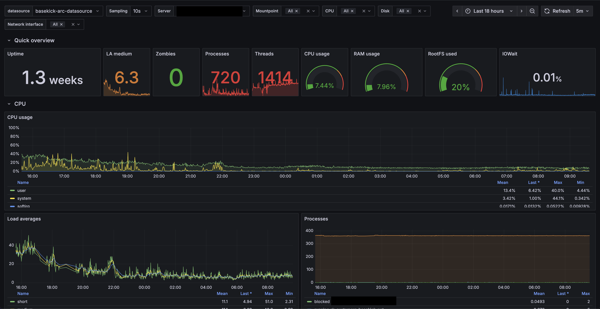
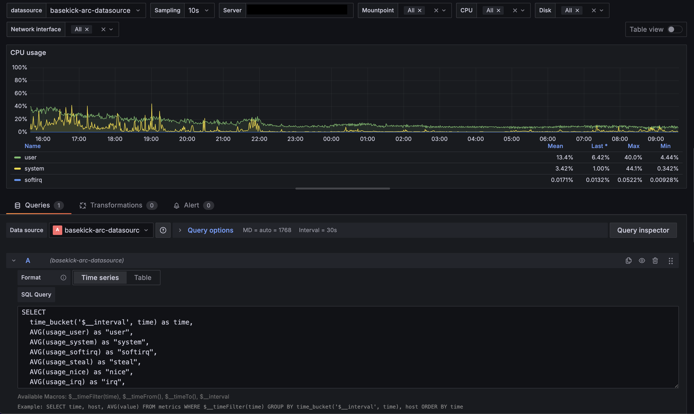
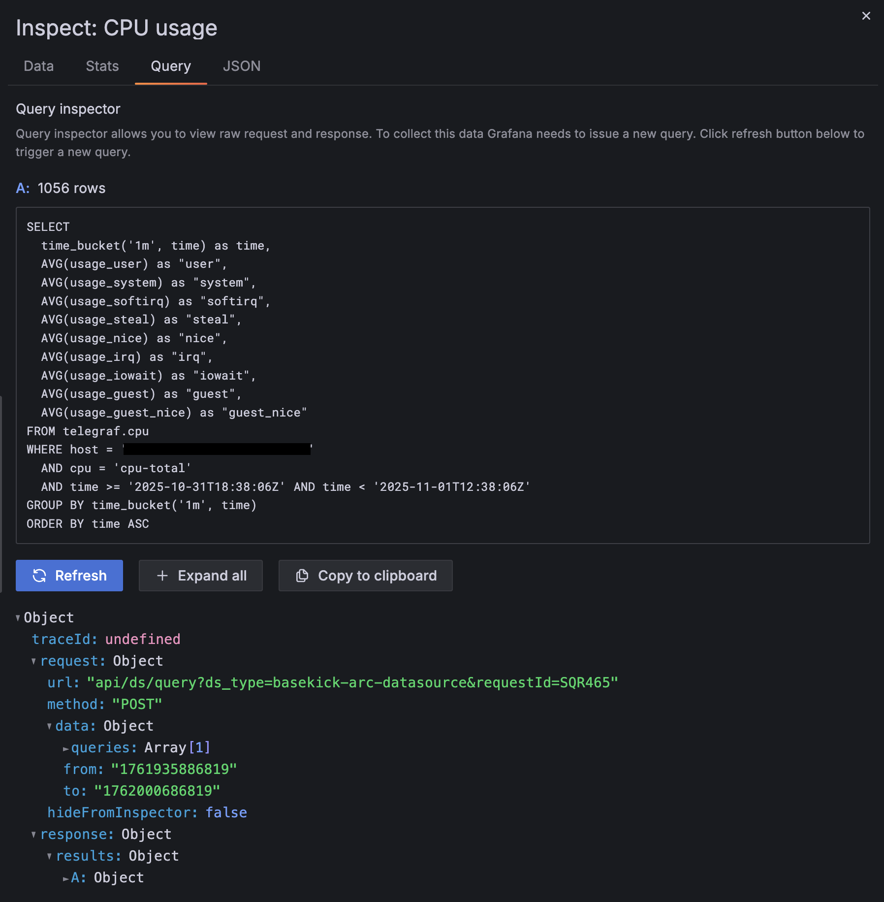
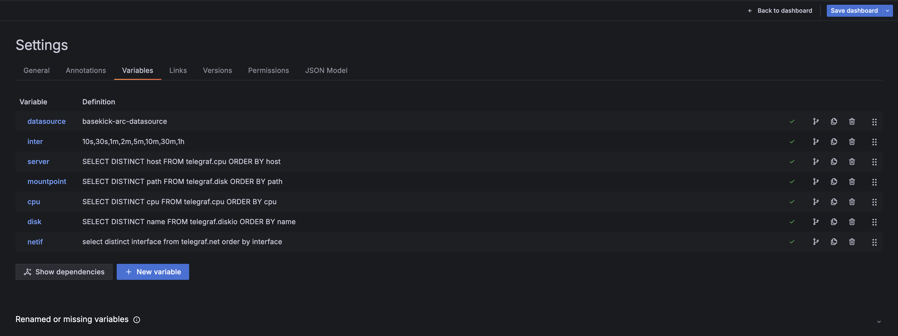
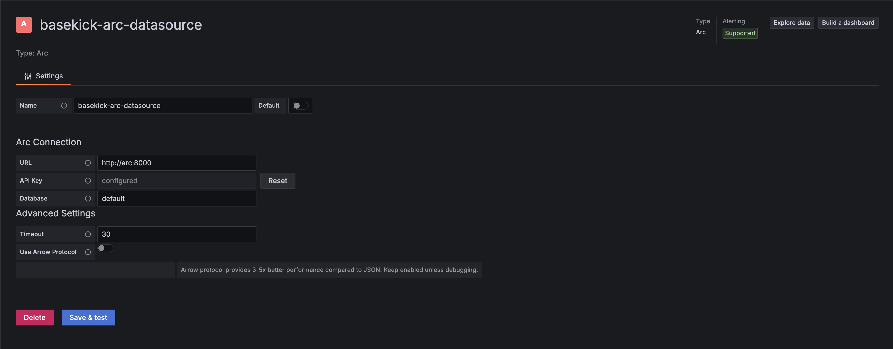
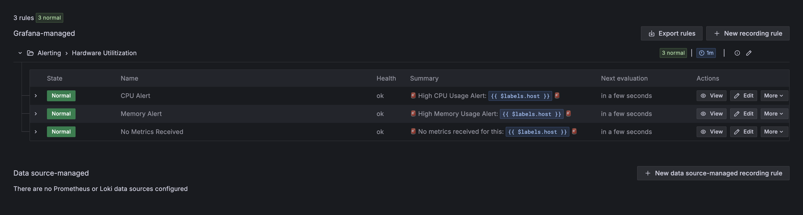

# Arc Datasource for Grafana

High-performance Grafana datasource plugin for Arc time-series database using Apache Arrow for efficient data transfer.

## Screenshots

### Dashboard with Real-time Monitoring


### Query Editor


### Data Inspector


### Variable Configuration


### Datasource Configuration


### Alerting


## Features

- **Apache Arrow Protocol**: Uses Arc's `/api/v1/query/arrow` endpoint for columnar data transfer
- **High Performance**: Optimized data processing with streaming deserialization
- **JSON Fallback**: Automatic fallback to JSON endpoint for compatibility
- **Alerting Support**: Full support for Grafana alerting and notifications
- **SQL Query Editor**: Full SQL support with syntax highlighting
- **Template Variables**: Dynamic dashboard filters with variable support
- **Time-series Optimized**: Native support for DuckDB time functions
- **Multi-database**: Query across different Arc databases/schemas
- **Secure**: API key authentication with secure credential storage

## Performance

Real-world performance metrics:
- **Data processing**: <1ms for time-series conversion
- **Query execution**: Depends on Arc server (typically 100-500ms)
- **Streaming deserialization**: Zero-copy Arrow IPC parsing
- **Optimized sorting**: O(n log n) time-series sorting

## Installation

### From Release

1. Download the latest release from GitHub releases
2. Extract to your Grafana plugins directory:
   ```bash
   unzip grafana-arc-datasource-<version>.zip -d /var/lib/grafana/plugins/
   ```
3. Restart Grafana:
   ```bash
   systemctl restart grafana-server
   ```

### From Source

```bash
# Clone repository
git clone https://github.com/basekick-labs/grafana-arc-datasource
cd grafana-arc-datasource

# Install dependencies
npm install

# Build plugin
npm run build

# Build backend
mage -v

# Install to Grafana
cp -r dist /var/lib/grafana/plugins/grafana-arc-datasource
systemctl restart grafana-server
```

## Configuration

1. In Grafana, go to **Configuration** → **Data sources**
2. Click **Add data source**
3. Search for and select **Arc**
4. Configure connection:
   - **URL**: Arc API endpoint (e.g., `http://localhost:8000`)
   - **API Key**: Your Arc authentication token
   - **Database** (optional): Default database/schema
5. Click **Save & Test**

### Configuration Options

| Option | Description | Required | Default |
|--------|-------------|----------|---------|
| URL | Arc API base URL | Yes | - |
| API Key | Authentication token | Yes | - |
| Database | Default database name | No | `default` |
| Timeout | Query timeout in seconds | No | `30` |
| Use Arrow | Enable Arrow protocol | No | `true` (recommended) |

## Usage

### Query Editor

The Arc datasource provides a SQL query editor with:
- Syntax highlighting
- Auto-completion for tables and columns
- Time range macros

#### Example Queries

**Basic time-series query (CPU usage):**
```sql
SELECT
  time_bucket(INTERVAL '$__interval', epoch_ms(time // 1000)) as time,
  AVG(usage_idle) * -1 + 100 AS cpu_usage,
  host
FROM telegraf.cpu
WHERE cpu = 'cpu-total'
  AND time >= epoch_us(TIMESTAMP $__timeFrom())
  AND time < epoch_us(TIMESTAMP $__timeTo())
GROUP BY time_bucket(INTERVAL '$__interval', epoch_ms(time // 1000)), host
ORDER BY time ASC
```

**Memory usage:**
```sql
SELECT
  time_bucket(INTERVAL '$__interval', epoch_ms(time // 1000)) as time,
  AVG(used_percent) AS memory_used,
  host
FROM telegraf.mem
WHERE time >= epoch_us(TIMESTAMP $__timeFrom())
  AND time < epoch_us(TIMESTAMP $__timeTo())
GROUP BY time_bucket(INTERVAL '$__interval', epoch_ms(time // 1000)), host
ORDER BY time ASC
```

**Network traffic (bytes to bits):**
```sql
SELECT
  time_bucket(INTERVAL '$__interval', epoch_ms(time // 1000)) as time,
  AVG(bytes_recv) * 8 AS bits_in,
  host,
  interface
FROM telegraf.net
WHERE time >= epoch_us(TIMESTAMP $__timeFrom())
  AND time < epoch_us(TIMESTAMP $__timeTo())
GROUP BY time_bucket(INTERVAL '$__interval', epoch_ms(time // 1000)), host, interface
ORDER BY time ASC
```

### Macros

The datasource provides several macros for dynamic queries:

| Macro | Description | Example |
|-------|-------------|---------|
| `$__timeFrom()` | Start of time range | `time >= epoch_us(TIMESTAMP $__timeFrom())` |
| `$__timeTo()` | End of time range | `time < epoch_us(TIMESTAMP $__timeTo())` |
| `$__interval` | Grafana's calculated interval | `time_bucket(INTERVAL '$__interval', ...)` |

### Variables

Create dashboard variables to make queries dynamic:

**Host variable:**
```sql
SELECT DISTINCT host FROM telegraf.cpu ORDER BY host
```

**Interface variable:**
```sql
SELECT DISTINCT interface FROM telegraf.net ORDER BY interface
```

Use variables in queries with `$variable` syntax:
```sql
SELECT
  time_bucket(INTERVAL '$__interval', epoch_ms(time // 1000)) as time,
  AVG(usage_idle) * -1 + 100 AS cpu_usage
FROM telegraf.cpu
WHERE host = '$server'
  AND cpu = 'cpu-total'
  AND time >= epoch_us(TIMESTAMP $__timeFrom())
  AND time < epoch_us(TIMESTAMP $__timeTo())
GROUP BY time_bucket(INTERVAL '$__interval', epoch_ms(time // 1000))
ORDER BY time ASC
```

### Alerting

The datasource fully supports Grafana alerting. Create alert rules with Arc queries:

**Example alert query (CPU usage > 80%):**
```sql
SELECT
  epoch_ms(time // 1000) as time,
  100 - usage_idle AS cpu_usage,
  host
FROM telegraf.cpu
WHERE cpu = 'cpu-total'
  AND time >= epoch_us(NOW() - INTERVAL '5 minutes')
ORDER BY time ASC
```

Then set alert condition: `WHEN avg() OF query(A, 5m, now) IS ABOVE 80`

## Development

### Prerequisites

- Node.js 18+
- Go 1.21+
- Mage (Go build tool)
- Grafana 10.0+

### Setup

```bash
# Install dependencies
npm install

# Install Go dependencies
go mod download

# Start development
npm run dev

# In another terminal, run backend
mage -v watch
```

### Project Structure

```
grafana-arc-datasource/
├── src/
│   ├── datasource.ts       # Main datasource implementation
│   ├── ConfigEditor.tsx    # Configuration UI
│   ├── QueryEditor.tsx     # Query editor UI
│   ├── VariableQueryEditor.tsx
│   └── module.ts           # Plugin entry point
├── pkg/
│   ├── plugin/
│   │   ├── datasource.go   # Backend datasource
│   │   ├── query.go        # Query handling
│   │   └── arrow.go        # Arrow protocol implementation
│   └── main.go
├── plugin.json             # Plugin metadata
├── package.json
├── go.mod
└── README.md
```

### Testing

```bash
# Frontend tests
npm run test

# Backend tests
go test ./pkg/...

# E2E tests
npm run e2e
```

## Architecture

### Data Flow

```
Grafana Dashboard
  ↓
Query Request (SQL)
  ↓
Frontend (TypeScript)
  ↓
Backend (Go)
  ↓
Arc API (/api/v1/query/arrow)
  ↓
Apache Arrow IPC Response
  ↓
Arrow Decoder (Go)
  ↓
Grafana DataFrame
  ↓
Visualization
```

### Arrow Protocol

The datasource uses Arc's Arrow endpoint for optimal performance:

1. **Query Submission**: SQL query sent to Arc with time range
2. **Columnar Response**: Arc returns Apache Arrow IPC stream
3. **Zero-Copy Decode**: Go Arrow library deserializes directly
4. **DataFrame Conversion**: Arrow Table → Grafana DataFrame
5. **Rendering**: Grafana visualizes data

Benefits:
- No JSON serialization/deserialization overhead
- Columnar format perfect for time-series
- Compression at protocol level
- Type-safe data transfer

## Troubleshooting

### Connection Issues

**Error: "Failed to connect to Arc"**
- Verify Arc is running: `curl http://localhost:8000/health`
- Check URL in datasource configuration
- Verify network connectivity

**Error: "Authentication failed"**
- Verify API key is valid
- Check token hasn't expired
- Ensure token has read permissions

### Query Issues

**Error: "Table not found"**
- Run `SHOW TABLES` to list available tables
- Verify database name is correct
- Check Arc has data for the measurement

**Slow queries:**
- Add `LIMIT` clause to limit result size
- Use time range filters with `$__timeFilter()`
- Add appropriate indexes in Arc
- Check Arc query performance with `EXPLAIN`

### Plugin Issues

**Plugin not appearing in Grafana:**
- Check plugin directory permissions
- Verify `plugin.json` is valid
- Restart Grafana after installation
- Check Grafana logs: `/var/log/grafana/grafana.log`

**Backend plugin not working:**
- Ensure backend binary is compiled: `mage -v`
- Check binary has execute permissions
- Verify Go version compatibility

## Performance Tips

1. **Use Arrow protocol**: Arrow is enabled by default and provides significantly faster data transfer compared to JSON
2. **Optimize time ranges**: Smaller time ranges mean faster queries. Use Grafana's time picker to narrow down your analysis
3. **Leverage time_bucket**: Use appropriate intervals in `time_bucket()` to avoid returning millions of points. Grafana will automatically adjust `$__interval` based on your dashboard width
4. **Index your time column**: Arc automatically indexes time columns, but ensure your queries filter by time first for optimal performance
5. **Enable caching**: Configure Grafana query caching for frequently accessed data

## Contributing

Contributions welcome! Please see [CONTRIBUTING.md](CONTRIBUTING.md) for guidelines.

### Building a Release

```bash
# Build frontend
npm run build

# Build backend for all platforms
mage -v buildAll

# Create release archive
npm run package
```

## License

Apache License 2.0 - see [LICENSE](LICENSE)

## Support

- GitHub Issues: https://github.com/basekick-labs/grafana-arc-datasource/issues
- Arc Documentation: https://docs.arc.io
- Grafana Plugin Development: https://grafana.com/docs/grafana/latest/developers/plugins/

## Related Projects

- [Arc](https://github.com/basekick-labs/arc) - High-performance time-series database
- [Telegraf Arc Output](https://github.com/basekick-labs/telegraf) - Telegraf output plugin for Arc
- [arc-superset-arrow](https://pypi.org/project/arc-superset-arrow/) - Apache Superset dialect for Arc

---

Built with ❤️ by [Basekick Labs](https://github.com/basekick-labs)
